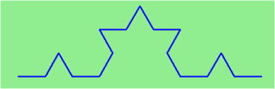
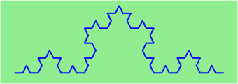
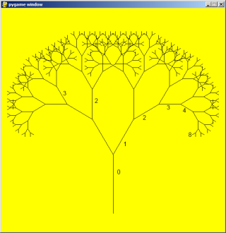
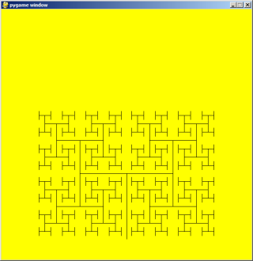

..  Copyright (C)  Peter Wentworth, Jeffrey Elkner, Allen B. Downey and Chris Meyers.
    Permission is granted to copy, distribute and/or modify this document
    under the terms of the GNU Free Documentation License, Version 1.3
    or any later version published by the Free Software Foundation;
    with Invariant Sections being Foreword, Preface, and Contributor List, no
    Front-Cover Texts, and no Back-Cover Texts.  A copy of the license is
    included in the section entitled "GNU Free Documentation License".
 
|      
    
Recursion
========= 

**Recursion** means "defining something in terms of itself" usually at some 
smaller scale, perhaps multiple times, to achieve your objective.  
For example, we might say "A human being is someone whose mother is a human being",
or "a directory is a structure that holds files and (smaller) directories", or "a family tree starts
with a couple who have children, each with their own family sub-trees".

Programming languages generally support **recursion**, which means that, in order
to solve a problem, functions can *call themselves* to solve smaller subproblems.  

Any problem that can be solved iteratively (with a for or while loop) can also be solved recursively. However, recursion takes a while wrap your head around, and because of this, it is generally only used in specific cases, where either your problem is recursive in nature, or your data is recursive.
   
Drawing Fractals
----------------

For our purposes, a **fractal** is a drawing which also has *self-similar* structure,
where it can be defined in terms of itself. This is a typical example of a problem which is recursive in nature.

Let us start by looking at the famous Koch fractal.  An order 0 Koch fractal is simply
a straight line of a given size.

An order 1 Koch fractal is obtained like this: instead of drawing just one line,
draw instead four smaller segments, in the pattern shown here:

Now what would happen if we repeated this Koch pattern again on each of the order 1 segments?  
We'd get this order 2 Koch fractal:

Repeating our pattern again gets us an order 3 Koch fractal:

Now let us think about it the other way around.  To draw a Koch fractal
of order 3, we can simply draw four order 2 Koch fractals.  But each of these
in turn needs four order 1 Koch fractals, and each of those in turn needs four
order 0 fractals.  Ultimately, the only drawing that will take place is 
at order 0. This is very simple to code up in Python:

.. sourcecode:: python3
    :linenos: 
   
    def koch(tortoise, order, size):
        """
           Make turtle tortoise draw a Koch fractal of 'order' and 'size'.
           Leave the turtle facing the same direction.
        """

        if order == 0:          # The base case is just a straight line
            tortoise.forward(size)
        else:
            koch(tortoise, order-1, size/3)   # Go 1/3 of the way
            tortoise.left(60)
            koch(tortoise, order-1, size/3)
            tortoise.right(120)
            koch(tortoise, order-1, size/3)
            tortoise.left(60)
            koch(tortoise, order-1, size/3) 
            
The key thing that is new here is that if order is not zero,
``koch`` calls itself recursively to get its job done.

Let's make a simple observation and tighten up this code.  Remember that
turning right by 120 is the same as turning left by -120.  So with a 
bit of clever rearrangement, we can use a loop instead of lines 10-16:

.. sourcecode:: python3
    :linenos:

    def koch(tortoise, order, size):
        if order == 0:                  
            tortoise.forward(size)
        else:
            for angle in [60, -120, 60, 0]:
               koch(tortoise, order-1, size/3)   
               tortoise.left(angle)
               
The final turn is 0 degrees --- so it has no effect.  But it has allowed us to
find a pattern and reduce seven lines of code to three, which will make  
things easier for our next observations.

.. admonition:: Recursion, the high-level view

    One way to think about this is to convince yourself that the function
    works correctly when you call it for an order 0 fractal.  Then do
    a mental *leap of faith*, saying *"the fairy godmother* (or Python, if
    you can think of Python as your fairy godmother) *knows how to 
    handle the recursive level 0 calls for me on lines 11, 13, 15, and 17, so
    I don't need to think about that detail!"*  All I need to focus on
    is how to draw an order 1 fractal *if I can assume the order 0 one is
    already working.*
    
    You're practicing *mental abstraction* --- ignoring the subproblem 
    while you solve the big problem.

    If this mode of thinking works (and you should practice it!), then take
    it to the next level.  Aha! now can I see that it will work when called
    for order 2 *under the assumption that it is already working for level 1*.  

    And, in general, if I can assume the order n-1 case works, can I just 
    solve the level n problem?

    Students of mathematics who have played with proofs of induction should
    see some very strong similarities here.  

.. admonition:: Recursion, the low-level operational view

    Another way of trying to understand recursion is to get rid of it! If we
    had separate functions to draw a level 3 fractal, a level 2 fractal, a level 1
    fractal and a level 0 fractal, we could simplify the above code, quite mechanically,
    to a situation where there was no longer any recursion, like this:
    
    .. sourcecode:: python3
        :linenos:
        
        def koch_0(tortoise, size):
            tortoise.forward(size)

        def koch_1(tortoise, size):
            for angle in [60, -120, 60, 0]:
               koch_0(tortoise, size/3)
               tortoise.left(angle)

        def koch_2(tortoise, size):
            for angle in [60, -120, 60, 0]:
               koch_1(tortoise, size/3)
               tortoise.left(angle)

        def koch_3(tortoise, size):
            for angle in [60, -120, 60, 0]:
               koch_2(tortoise, size/3)
               tortoise.left(angle)
    
    This trick of "unrolling" the recursion gives us an operational view
    of what happens.  You can trace the program into ``koch_3``, and from
    there, into ``koch_2``, and then into ``koch_1``, etc., all the way down
    the different layers of the recursion.  
    
    This might be a useful hint to build your understanding.  The mental goal
    is, however, to be able to do the abstraction!

.. index::
    single: data structure
    single: data structure; recursive
    single: recursive definition
    single: definition; recursive
    single: recursive data structure
       
Recursive data structures
-------------------------

Most of the Python data types we have seen can be grouped inside lists and
tuples in a variety of ways. Lists and tuples can also be nested, providing 
many possibilities for organizing data. The organization of data for the
purpose of making it easier to use is called a **data structure**.

It's election time and we are helping to compute the votes as they come in.
Votes arriving from individual wards, precincts, municipalities, counties, and
states are sometimes reported as a sum total of votes and sometimes as a list
of subtotals of votes. After considering how best to store the tallies, we
decide to use a *nested number list*, which we define as follows:

A *nested number list* is a list whose elements are either:

a. numbers
b. nested number lists

Notice that the term, *nested number list* is used in its own definition.
**Recursive definitions** like this are quite common in mathematics and
computer science. They provide a concise and powerful way to describe
**recursive data structures** that are partially composed of smaller and
simpler instances of themselves. The definition is not circular, since at some
point we will reach a list that does not have any lists as elements.

Now suppose our job is to write a function that will sum all of the values in a
nested number list. Python has a built-in function which finds the sum of a
sequence of numbers:

.. sourcecode:: python3
    
    >>> sum([1, 2, 8])
    11

For our *nested number list*, however, ``sum`` will not work:

.. sourcecode:: python3
    
    >>> sum([1, 2, [11, 13], 8])
    Traceback (most recent call last):
      File "<interactive input>", line 1, in <module>
    TypeError: unsupported operand type(s) for +: 'int' and 'list'
    >>> 

The problem is that the third element of this list, ``[11, 13]``, is itself a
list, so it cannot just be added to ``1``, ``2``, and ``8``.

.. index:: recursion, recursive call, base case, infinite recursion, recursion; infinite

Processing recursive number lists
---------------------------------

To sum all the numbers in our recursive nested number list we need to traverse
the list, visiting each of the elements within its nested structure, adding any
numeric elements to our sum, and *recursively repeating the summing process* with any elements
which are themselves sub-lists.

Thanks to recursion, the Python code needed to sum the values of a nested number list is
surprisingly short:

.. sourcecode:: python3
    :linenos: 
    
    def recursive_sum(nested_number_list):
        """Returns the total sum of all elements in nested_number_list"""
        total = 0
        for element in nested_number_list:
            if type(element) is list:
                total += recursive_sum(element)
            else:
                total += element
        return total

.. Victor: Type comparison in this chapter is done using the `type` function and
   `is` operator. The `isinstance` function is the preferred way to
   compare types but it hasn't been introduced yet.
   
   Peter: I prefer teaching this style: once again Python has different ways
   to do the same thing. What I dislike about isinstance is that one has
   to remember the typename to use the function.  So I cannot easily recall
   whether the type([]) is `list`, `lst`, `"lst"` or `"list"`.  And
   if I use a variable called `list` or `str` in my program, isinstance breaks.
   (Well, I suppose it also breaks if I use `type` as a variable!) 

The body of ``recursive_sum`` consists mainly of a ``for`` loop that traverses
``nested_number_list``. If ``element`` is a numerical value (the ``else`` branch),
it is simply added to ``total``. If ``element`` is a list, then ``recursive_sum``
is called again, with the element as an argument.  The statement inside the
function definition in which the function calls itself is known as the
**recursive call**.

The example above has a **base case** (on line 13) which does not lead to a
recursive call: the case where the element is not a (sub-) list. Without
a base case, you'll have **infinite recursion**, and your program will not work.

An alternative solution, completely recursive, would be the following. Notice that this implementation does not contain a ``for`` loop!

.. sourcecode:: python3
    :linenos:

    def recursive_sum(nested_number_list):
        """Returns the total sum of all elements in nested_number_list"""
        if len(nested_number_list) == 0:
            return 0
        head, *tail = nested_number_list #Assign the first element of nested_number_list to head, and the rest to tail.
        if isinstance(head, list):  # If head is a list....
            return recursive_sum(head) + recursive_sum(tail)
        else:
            return head + recursive_sum(tail)

Recursion is truly one of the most beautiful and elegant tools in computer
science.

A slightly more complicated problem is finding the largest value in our nested
number list:

.. sourcecode:: python3
    :linenos:
    
    def recursive_max(nested_list):
        """ 
          Find the maximum in a recursive structure of lists 
          within other lists.
          Precondition: No lists or sublists are empty. 
        """
        largest = None 
        first_time = True
        for element in nested_list:
            if type(element) is list:
                value = recursive_max(element)
            else:
                value = element
                
            if first_time or value > largest:
                largest = value
                first_time = False

        return largest

The added twist to this problem is finding a value for initializing
``largest``. We can't just use ``nested_list[0]``, since that could be either
a element or a list. To solve this problem (at every recursive call)
we initialize a Boolean flag (at line 8).  When we've found the value of interest,
(at line 15) we check to see whether this is the initializing (first) value for
``largest``, or a value that could potentially change ``largest``.

Again here we have a base case at line 13.  If we don't supply a base case,
Python stops after reaching a maximum recursion depth and returns a runtime
error.  See how this happens, by running this little script which we will call `infinite_recursion.py`: 

.. sourcecode:: python3
    :linenos:
    
    def recursion_depth(number):
        print("{0}, ".format(number), end="")
        recursion_depth(number + 1)

    recursion_depth(0)

After watching the messages flash by, you will be presented with the end of a
long traceback that ends with a message like the following::

    RuntimeError: maximum recursion depth exceeded ...

We would certainly never want something like this to happen to a user of one of
our programs, so in another appendix we'll see how
errors, any kinds of errors, are handled in Python.

.. index:: fibonacci numbers

Case study: Fibonacci numbers  
----------------------------- 

The famous **Fibonacci sequence** 0, 1, 1, 2, 3, 5, 8, 13, 21, 34, 55, 89, 134, ... was devised by 
Fibonacci (1170-1250), who used this to model the breeding of (pairs) of rabbits.   
If, in generation 7 you had 21 pairs in total, of which 13 were adults, 
then next generation the adults will all have bred new children, 
and the previous children will have grown up to become adults.  
So in generation 8 you'll have 13+21=34, of which 21 are adults.

This *model* to explain rabbit breeding made the simplifying assumption that rabbits never died. 
Scientists often make (unrealistic) simplifying assumptions and restrictions 
to make some headway with the problem.

If we number the terms of the sequence from 0, we can describe each term recursively
as the sum of the previous two terms::
 
    fib(0) = 0
    fib(1) = 1
    fib(n) = fib(n-1) + fib(n-2)  for n >= 2

This translates very directly into some Python: 

.. sourcecode:: python3
    :linenos:

    def fib(n):
        if n <= 1:
            return n
        t = fib(n-1) + fib(n-2)
        return t

This is a particularly inefficient algorithm, and this could be solved far more efficient iteratively:

.. sourcecode:: python3
    :linenos:
    
    import time
    t0 = time.clock()
    n = 35
    result = fib(n)
    t1 = time.clock()
    
    print("fib({0}) = {1}, ({2:.2f} secs)".format(n, result, t1-t0))
    
    
We get the correct result, but an exploding amount of work! ::

     fib(35) = 9227465, (10.54 secs)
    

Example with recursive directories and files
--------------------------------------------

The following program lists the contents of a directory and all its subdirectories.

.. sourcecode:: python3
    :linenos:
    
    import os

    def get_dirlist(path):
        """ 
          Return a sorted list of all entries in path.
          This returns just the names, not the full path to the names.
        """
        dirlist = os.listdir(path)
        dirlist.sort()
        return dirlist

    def print_files(path, prefix = ""):
        """ Print recursive listing of contents of path """
        if prefix == "":  # Detect outermost call, print a heading
            print("Folder listing for", path)
            prefix = "| "

        dirlist = get_dirlist(path)
        for file in dirlist:
            print(prefix+file)                    # Print the line 
            fullname = os.path.join(path, file)   # Turn name into full pathname
            if os.path.isdir(fullname):        # If a directory, recurse. 
                print_files(fullname, prefix + "| ")

Calling the function ``print_files`` with some folder name will produce output similar to this::       
 
    Folder listing for c:\python31\Lib\site-packages\pygame\examples
    | __init__.py
    | aacircle.py
    | aliens.py
    | arraydemo.py
    | blend_fill.py
    | blit_blends.py
    | camera.py
    | chimp.py
    | cursors.py
    | data
    | | alien1.png
    | | alien2.png
    | | alien3.png
    ...    

Note that something similar is already implemented in the os module: os.walk. 

An animated fractal, using PyGame
---------------------------------

Here we have a tree fractal pattern of order 8.  We've labelled some of the edges,
showing the depth of the recursion at which each edge was drawn.  

In the tree above, the angle of deviation from the trunk is 30 degrees. 
Varying that angle gives other interesting shapes, for example, with
the angle at 90 degrees we get this:
 

An interesting animation occurs if we generate and draw trees very rapidly,
each time varying the angle a little. Although the Turtle module can draw trees
like this quite elegantly, we could struggle for good frame rates.  
So we'll use PyGame instead, with a few embellishments and observations. 
(Once again, we suggest you cut and paste this code into your Python environment.)  

.. sourcecode:: python3
    :linenos:

    import pygame, math
    pygame.init()           # prepare the pygame module for use

    # Create a new surface and window.
    surface_size = 1024
    main_surface = pygame.display.set_mode((surface_size,surface_size))
    my_clock = pygame.time.Clock()

    
    def draw_tree(order, theta, size, position, heading, color=(0,0,0), depth=0):

       trunk_ratio = 0.29       # How big is the trunk relative to whole tree?
       trunk = size * trunk_ratio # length of trunk 
       delta_x = trunk * math.cos(heading)
       delta_y = trunk * math.sin(heading)
       (u, v) = position
       newposition = (u + delta_x, v + delta_y)
       pygame.draw.line(main_surface, color, position, newposition)

       if order > 0:   # Draw another layer of subtrees

          # These next six lines are a simple hack to make the two major halves
          # of the recursion different colors. Fiddle here to change colors
          # at other depths, or when depth is even, or odd, etc.
          if depth == 0:
              color1 = (255, 0, 0)
              color2 = (0, 0, 255)
          else:
              color1 = color
              color2 = color

          # make the recursive calls to draw the two subtrees
          newsize = size*(1 - trunk_ratio)
          draw_tree(order-1, theta, newsize, newposition, heading-theta, color1, depth+1)
          draw_tree(order-1, theta, newsize, newposition, heading+theta, color2, depth+1)

    def gameloop():
    
        theta = 0
        while True:

            # Handle evente from keyboard, mouse, etc.
            event = pygame.event.poll()
            if event.type == pygame.QUIT:
                break;

            # Updates - change the angle
            theta += 0.01

            # Draw everything
            main_surface.fill((255, 255, 0))
            draw_tree(9, theta, surface_size*0.9, (surface_size//2, surface_size-50), -math.pi/2)

            pygame.display.flip()
            my_clock.tick(120)

            
    gameloop()
    pygame.quit()

* The ``math`` library works with angles in radians rather than degrees.
* Lines 14 and 15 uses some high school trigonmetry.  From the length of the desired line (``trunk``), 
  and its desired angle, ``cos`` and ``sin`` help us to calculate the ``x`` and ``y`` 
  distances we need to move. 
 
* Lines 22-30 are unnecessary, except if we want a colorful tree.
* In the main game loop at line 49 we change the angle on every frame, and redraw
  the new tree.  
* Line 18 shows that PyGame can also draw lines, and plenty more.  Check out the
  documentation.  For example, drawing a small circle at each branch point of the
  tree can be accomplished by adding this line directly below line 18:
  
  .. sourcecode:: python3
    :linenos: 
    
    pygame.draw.circle(main_surface, color, (int(position[0]), int(position[1])), 3)
  

Another interesting effect --- instructive too, if you wish to reinforce the idea
of different instances of the function being called at different depths of recursion ---
is to create a list of colors, and let each recursive depth use a different color 
for drawing. (Use the depth of the recursion to index the list of colors.)

Mutual Recursion
----------------

In addition to a function calling just itself, it is also possible to make multiple functions that call eachother. This is rarely really usefull, but it can be used to make state machines.

.. sourcecode:: python3
    :linenos:

    def function_a(n):  # Do things associated with state A
        if n == 0:
            return
        print('a')
        function_b(n - 1)  # Proceed to state B

    def function_b(n):  # Do things associated with state B
        print('b')
        function_a(n - 1)  # Proceed to state A

Glossary
--------

.. glossary::

    base case
        A branch of the conditional statement in a recursive function that does
        not give rise to further recursive calls.

    infinite recursion
        A function that calls itself recursively without ever reaching any base
        case. Eventually, infinite recursion causes a runtime error.

    recursion
        The process of calling a function that is already executing.

    recursive call
        The statement that calls an already executing function.  Recursion can
        also be indirect --- function `f` can call `g` which calls `h`, 
        and `h` could make a call back to `f`.

    recursive definition
        A definition which defines something in terms of itself. To be useful
        it must include *base cases* which are not recursive. In this way it
        differs from a *circular definition*.  Recursive definitions often
        provide an elegant way to express complex data structures, like a directory
        that can contain other directories, or a menu that can contain other menus.

Exercises
---------
   
#. Modify the Koch fractal program so that it draws a Koch snowflake, like this:

   .. image:: illustrations/koch_snowflake.png
   
   |
   
   .. index:: fractal; Cesaro torn square
   
#. a.  Draw a Cesaro torn line fractal, of the order given by the user.  
       We show four different lines of orders 0,1,2,3.     
       In this example, the angle of the tear is 10 degrees.   
      
       .. image:: illustrations/cesaro_torn_line.png
       
   b.  Four lines make a square.  Use the code in part a) to draw cesaro squares.
       Varying the angle gives interesting effects --- experiment a bit, 
       or perhaps let the user input the angle of the tear. 

       .. image:: illustrations/cesaro_torn_square.png
   
   .. index:: fractal; Sierpinski triangle
   
   c. (For the mathematically inclined). In the squares shown here, the higher-order drawings
      become a little larger. (Look at the bottom lines of each square - they're not aligned.)
      This is because we just halved the drawn part of the line for each recursive subproblem.  
      So we've "grown" the overall square by the width of the tear(s).  
      Can you solve the geometry problem so that the total size of the subproblem case 
      (including the tear) remains exactly the same size as the original?
 
   |
   
#. A Sierpinski triangle of order 0 is an equilateral triangle.  
   An order 1 triangle can be drawn by drawing 3 smaller triangles 
   (shown slightly disconnected here, just to help our understanding).   
   Higher order 2 and 3 triangles are also shown.  
   Draw Sierpinski triangles of any order input by the user.   
   
   .. image:: illustrations/sierpinski.png
  
#. Adapt the above program to change the color of its three sub-triangles at some depth
   of recursion. The illustration below shows two cases: on the left, the color is changed at depth 0
   (the outmost level of recursion), on the right, at depth 2. If the user supplies a negative
   depth, the color never changes.
   (Hint: add a new optional parameter ``colorChangeDepth`` (which defaults to -1), and make this one
   smaller on each recursive subcall. Then, in the section of code before you recurse, test
   whether the parameter is zero, and change color.)

   .. image:: illustrations/sierpinski_color.png
   
   
#. Write a function, ``recursive_min``, that returns the smallest value in a
   nested number list.  Assume there are no empty lists or sublists:
 
#. Write a function ``count`` that returns the number of occurrences
   of ``target`` in  a nested list:
 
#. Write a function ``flatten`` that returns a simple list  
   containing all the values in a nested list:
       
#. Rewrite the fibonacci algorithm without using recursion. Can you find bigger
   terms of the sequence?  Can you find ``fib(200)``?
   
#. Use help to find out what ``sys.getrecursionlimit()`` and
   ``sys.setrecursionlimit(n)`` do. Create several experiments similar to what
   was done in `infinite_recursion.py`
   to test your understanding of how these module functions work.
 
#. Write a program that walks a directory structure (as in the last section of
   this chapter), but instead of printing filenames, it returns a list of all
   the full paths of files in the directory or the subdirectories.  (Don't include
   directories in this list --- just files.)  For example, the output list might
   have elements like this::
   
      ["C:\Python31\Lib\site-packages\pygame\docs\ref\mask.html",
       "C:\Python31\Lib\site-packages\pygame\docs\ref\midi.html",
       ...
       "C:\Python31\Lib\site-packages\pygame\examples\aliens.py",
       ...
       "C:\Python31\Lib\site-packages\pygame\examples\data\boom.wav", 
       ... ]   

#. Write a program named ``litter.py`` that creates an empty file named
   ``trash.txt`` in each subdirectory of a directory tree given the root of the 
   tree as an argument (or the current directory as a default). Now write a
   program named ``cleanup.py`` that removes all these files.

   *Hint #1:* Use the program from the example in the last section of this
   chapter as a basis for these two recursive programs.  Because you're
   going to destroy files on your disks, you better get this right, or
   you risk losing files you care about.  So excellent advice is that
   initially you should fake the deletion of the files --- just print
   the full path names of each file that you intend to delete.  Once
   you're happy that your logic is correct, and you can see that you're
   not deleting the wrong things, you can replace the print statement
   with the real thing.

   *Hint #2:* Look in the ``os`` module for a function that removes
   files.
