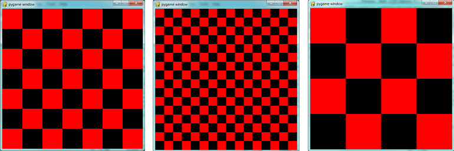

..  Copyright (C)  Peter Wentworth, Jeffrey Elkner, Allen B. Downey and Chris Meyers.
    Permission is granted to copy, distribute and/or modify this document
    under the terms of the GNU Free Documentation License, Version 1.3
    or any later version published by the Free Software Foundation;
    with Invariant Sections being Foreword, Preface, and Contributor List, no
    Front-Cover Texts, and no Back-Cover Texts.  A copy of the license is
    included in the section entitled "GNU Free Documentation License".

|
    
.. index:: game loop, surface, PyGame, poll   
    
PyGame
======

PyGame is a package that is not part of the standard Python distribution, so if you do not
already have it installed (i.e. ``import pygame`` fails), download and install a suitable version from http://pygame.org/download.shtml.
These notes are based on PyGame 1.9.1, the most recent version at the time of writing.

PyGame comes with a substantial set of tutorials, examples, and help, so there is ample
opportunity to stretch yourself on the code. You may need to look around a bit to find 
these resources, though: if you've installed PyGame on a Windows machine, for example,
they'll end up in a folder like C:\\Python31\\Lib\\site-packages\\pygame\\ where you 
will find directories for *docs* and *examples*.
 

The game loop
-------------

The structure of the games we'll consider always follows this fixed pattern: 

    .. image:: illustrations/pygame_structure.png  

In every game, in the *setup* section we'll create a window, load and prepare some content, and then
enter the **game loop**.  The game loop continuously does four main things:

* it **polls** for events --- i.e. asks the system whether
  events have occurred --- and responds appropriately, 
* it updates whatever internal data structures or objects need changing, 
* it draws the current state of the game into a (non-visible) surface,
* it puts the just-drawn surface on display. 

..

  .. sourcecode:: python3
        :linenos:

        import pygame     

        def main():
            """ Set up the game and run the main game loop """
            pygame.init()      # Prepare the pygame module for use
            surface_size = 480   # Desired physical surface size, in pixels.
            
            # Create surface of (width, height), and its window.
            main_surface = pygame.display.set_mode((surface_size, surface_size))
            
            # Set up some data to describe a small rectangle and its color
            small_rect = (300, 200, 150, 90)
            some_color = (255, 0, 0)        # A color is a mix of (Red, Green, Blue)

            while True:
                event = pygame.event.poll()    # Look for any event
                if event.type == pygame.QUIT:  # Window close button clicked?
                    break                   #   ... leave game loop 

                # Update your game objects and data structures here...    
                    
                # We draw everything from scratch on each frame.
                # So first fill everything with the background color
                main_surface.fill((0, 200, 255))
                
                # Overpaint a smaller rectangle on the main surface
                main_surface.fill(some_color, small_rect)

                # Now the surface is ready, tell pygame to display it!
                pygame.display.flip()

            pygame.quit()     # Once we leave the loop, close the window.
                             
        main()
    
This program pops up a window which stays there until we close it:

    .. image:: illustrations/pygame_screenshot01.png 

PyGame does all its drawing onto rectangular *surfaces*. After initializing PyGame 
at line 5, we create a window holding our main surface. The main loop of the game 
extends from line 15 to 30, with the following key bits of logic:

* First (line 16) we poll to fetch the next event that might be ready for us.  This step will
  always be followed by some conditional statements that will determine whether 
  any event that we're interested in has happened.  Polling for the event consumes
  it, as far as PyGame is concerned, so we only get one chance to fetch and use 
  each event.   On line 17 we test whether the type of the event is the 
  predefined constant called pygame.QUIT.  This is the event that we'll see
  when the user clicks the close button on the PyGame window.   In response to
  this event, we leave the loop.
* Once we've left the loop, the code at line 32 closes window, and we'll return 
  from function ``main``.  Your program could go on to do other things, or reinitialize
  pygame and create another window, but it will usually just end too.
* There are different kinds of events --- key presses, mouse motion, mouse
  clicks, joystick movement, and so on.  It is usual that we test and handle all these cases
  with new code squeezed in before line 19.  The general idea is "handle events
  first, then worry about the other stuff".  
* At line 20 we'd update objects or data --- for example, if we wanted to vary the
  color, position, or size of the rectangle we're about to draw, we'd re-assign 
  ``some_color``, and ``small_rect`` here.  
* A modern way to write games (now that we have fast computers and fast graphics
  cards) is to redraw everything from scratch on every iteration of the game loop.  So
  the first thing we do at line 24 is fill the entire surface with a background
  color.  The ``fill`` method of a surface takes two arguments --- the color to 
  use for filling, and the rectangle to be filled.  But the second argument is 
  optional, and if it is left out the entire surface is filled.  
* In line 27 we fill a second rectangle, this time using ``some_color``.
  The placement and size of the rectangle are given by the tuple ``small_rect``, 
  a 4-element tuple ``(x, y, width, height)``.   
* It is important to understand that the origin of the PyGame's surface is at the top left
  corner (unlike the turtle module that puts its origin in the middle of the screen).
  So, if you wanted the rectangle closer to the top of the window, you need to make its
  y coordinate smaller.
* If your graphics display hardware tries to read from memory at the 
  same time as the program is writing to that memory, they will interfere with each other,
  causing video noise and flicker.  To get around this, PyGame keeps two 
  buffers in the main surface --- the *back buffer* that the program draws to, 
  while the *front buffer* is being shown to the user.  Each time the program has fully
  prepared its back buffer, it flips the back/front role of the two buffers. 
  So the drawing on lines 24 and 27 does does not 
  change what is seen on the screen until 
  we ``flip`` the buffers, on line 30.
 
 
Displaying images and text
--------------------------

To draw an image on the main surface, we load the 
image, say a beach ball, into its own new surface. 
The main surface has a ``blit`` method that copies 
pixels from the beach ball surface into its
own surface.  When we call ``blit``, we can specify where the beach ball should be placed
on the main surface.  The term **blit** is widely used in computer graphics, and means
*to make a fast copy of pixels from one area of memory to another*.

So in the setup section, before we enter the game 
loop, we'd load the image, like this:

    .. sourcecode:: python3
        :linenos:

        ball = pygame.image.load("ball.png")
      
and after line 28 in the program above, we'd add this 
code to display our image at position (100,120):

    .. sourcecode:: python3
        :linenos:
        
        main_surface.blit(ball, (100, 120))
 
To display text, we need do do three things.  Before we enter the game loop, we
instantiate a ``font`` object:

    .. sourcecode:: python3
        :linenos:
        
        # Instantiate 16 point Courier font to draw text.
        my_font = pygame.font.SysFont("Courier", 16) 
      
and after line 28, again, we use the font's 
``render`` method to create a new surface 
containing the pixels of the drawn text,
and then, as in the case for images, we blit 
our new surface onto the main surface.  Notice that ``render``
takes two extra parameters --- the second tells 
it whether to carefully smooth edges of the text
while drawing (this process is called *anti-aliasing*), 
and the second is the color that 
we want the text text be.  Here we've used ``(0,0,0)`` 
which is black:
      
    .. sourcecode:: python3
        :linenos:
        
        the_text = my_font.render("Hello, world!", True, (0,0,0))
        main_surface.blit(the_text, (10, 10))
       
We'll demonstrate these two new features by counting 
the frames --- the iterations of the game loop --- and keeping
some timing information.  On each frame, we'll 
display the frame count, and the frame rate.  We will only update
the frame rate after every 500 frames, when we'll 
look at the timing interval and can do the calculations.
 
    .. sourcecode:: python3
        :linenos:
       
        import pygame     
        import time

        def main():

            pygame.init()    # Prepare the PyGame module for use
            main_surface = pygame.display.set_mode((480, 240))

            # Load an image to draw. Substitute your own.
            # PyGame handles gif, jpg, png, etc. image types.
            ball = pygame.image.load("ball.png")  

            # Create a font for rendering text
            my_font = pygame.font.SysFont("Courier", 16)

            frame_count = 0
            frame_rate = 0
            t0 = time.clock()

            while True:

                # Look for an event from keyboard, mouse, joystick, etc.
                ev = pygame.event.poll()
                if ev.type == pygame.QUIT:   # Window close button clicked?
                    break                    # Leave game loop

                # Do other bits of logic for the game here
                frame_count += 1
                if frame_count % 500 == 0:
                    t1 = time.clock()
                    frame_rate = 500 / (t1-t0)
                    t0 = t1

                # Completely redraw the surface, starting with background
                main_surface.fill((0, 200, 255))

                # Put a red rectangle somewhere on the surface
                main_surface.fill((255,0,0), (300, 100, 150, 90))

                # Copy our image to the surface, at this (x,y) posn
                main_surface.blit(ball, (100, 120))

                # Make a new surface with an image of the text
                the_text = my_font.render("Frame = {0},  rate = {1:.2f} fps"
                          .format(frame_count, frame_rate), True, (0,0,0))
                # Copy the text surface to the main surface
                main_surface.blit(the_text, (10, 10))

                # Now that everything is drawn, put it on display!
                pygame.display.flip()

            pygame.quit()   

            
        main()
   

The frame rate is close to ridiculous --- 
a lot faster than one's eye can process frames. (Commercial
video games usually plan their action for 60 
frames per second (fps).)  Of course, our rate will drop
once we start doing something a little more strenuous inside our game loop.
 
    .. image:: illustrations/pygame_screenshot02.png 

    
Drawing a board for the N queens puzzle
---------------------------------------

We previously solved our N queens puzzle.  
For the 8x8 board, one of the solutions was the list ``[6,4,2,0,5,7,1,3]``.   
Let's use that solution as testdata, and now use PyGame to draw that 
chessboard with its queens.

We'll create a new module for the drawing code, called ``draw_queens.py``. When
we have our test case(s) working, we can go back to our solver, import this new module,
and add a call to our new function to draw a board each time a solution is discovered.

We begin with a background of black and red squares 
for the board. Perhaps we could create an image that we could
load and draw, but that approach would need 
different background images for different size boards.  
Just drawing our own red and black rectangles of 
the appropriate size sounds like much more fun!  

    .. sourcecode:: python3
        :linenos:

        def draw_board(the_board):
            """ Draw a chess board with queens, from the_board. """

            pygame.init()                  
            colors = [(255,0,0), (0,0,0)]    # Set up colors [red, black]

            n = len(the_board)         # This is an NxN chess board.
            surface_size = 480           # Proposed physical surface size.                          
            square_size = surface_size // n    # sq_sz is length of a square.          
            surface_size = n * square_size     # Adjust to exactly fit n squares.

            # Create the surface of (width, height), and its window.
            surface = pygame.display.set_mode((surface_size, surface_size))

Here we precompute ``square_size``, the integer 
size that each square will be, so that we can fit the squares
nicely into the available window.  So if 
we'd like the board to be 480x480, and we're drawing an 8x8 
chessboard, then each square will need 
to have a size of 60 units.  But we 
notice that a 7x7 board cannot 
fit nicely into 480 --- we're going to 
get some ugly border that our squares don't fill exactly.   
So we recompute the surface size to exactly 
fit our squares before we create the window.
        
Now let's draw the squares, in the game loop.  
We'll need a nested loop: the outer loop will
run over the rows of the chessboard, the 
inner loop over the columns:

    .. sourcecode:: python3
        :linenos:

        # Draw a fresh background (a blank chess board)
        for row in range(n):           # Draw each row of the board.
            color_index = row % 2           # Change starting color on each row
            for col in range(n):       # Run through cols drawing squares
                the_square = (col*square_size, row*square_size, square_size, square_size)
                surface.fill(colors[color_index], the_square)
                # now flip the color index for the next square 
                c_index = (c_index + 1) % 2   
        
There are two important ideas in this code: firstly, 
we compute the rectangle to be filled
from the ``row`` and ``col`` loop variables, 
multiplying them by the size of the square to
get their position.  And, of course, each 
square is a fixed width and height.  So ``the_square``
represents the rectangle to be filled on the 
current iteration of the loop.  The second idea
is that we have to alternate colors on 
every square.  In the earlier setup code we created 
a list containing two colors, here we 
manipulate ``color_index``  (which will always either have
the value 0 or 1) to start each row on a 
color that is different from the previous row's
starting color, and to switch colors each 
time a square is filled.

This (together with the other fragments not shown to flip the surface onto the display) leads
to the pleasing backgrounds like this, for different size boards:

Now, on to drawing the queens!  Recall that our 
solution ``[6,4,2,0,5,7,1,3]`` means that
in column 0 of the board we want a queen at 
row 6, at column 1 we want a queen at row 4, 
and so on. So we need a loop running over each queen:

    .. sourcecode:: python3
        :linenos:

        for (col, row) in enumerate(the_board):
            # draw a queen at col, row...

In this chapter we already have a beach ball image, 
so we'll use that for our queens.  In the
setup code before our game loop, we load the ball 
image (as we did before), and in the body of
the loop, we add the line: 

    .. sourcecode:: python3
        :linenos:

        surface.blit(ball, (col * square_size, row * square_size))
    
    .. image:: illustrations/pygame_screenshot04.png

We're getting there, but those queens need to be 
centred in their squares!  Our problem arises from
the fact that both the ball and the rectangle have 
their upper left corner as their reference points.
If we're going to centre this ball in the square, 
we need to give it an extra offset in both the
x and y direction.  (Since the ball is round and 
the square is square, the offset in the two directions
will be the same, so we'll just compute a single offset 
value, and use it in both directions.)

The offset we need is half the (size of the square less the size 
of the ball).  So we'll precompute
this in the game's setup section, after we've loaded the ball 
and determined the square size:

    .. sourcecode:: python3
        :linenos:

        ball_offset = (square_size - ball.get_width()) // 2
    

Now we touch up the drawing code for the ball and we're done:  

    .. sourcecode:: python3
        :linenos:
 
        surface.blit(ball, (col * square_size + ball_offset, row * square_size + ball_offset))    

We might just want to think about what would happen if the ball was bigger than
the square.  In that case, ``ball_offset`` would become negative.  
So it would still be centered in the square - it would just spill 
over the boundaries, or perhaps obscure the square entirely! 

Here is the complete program:

    .. sourcecode:: python3
        :linenos:

        import pygame      

        def draw_board(the_board):
            """ Draw a chess board with queens, as determined by the the_board. """

            pygame.init()                  
            colors = [(255,0,0), (0,0,0)]    # Set up colors [red, black]

            n = len(the_board)         # This is an NxN chess board.
            surface_size = 480           # Proposed physical surface size.                          
            square_size = surface_size // n    # sq_sz is length of a square.          
            surface_size = n * square_size     # Adjust to exactly fit n squares.

            # Create the surface of (width, height), and its window.
            surface = pygame.display.set_mode((surface_size, surface_size))

            ball = pygame.image.load("ball.png")

            # Use an extra offset to centre the ball in its square.
            # If the square is too small, offset becomes negative,
            #   but it will still be centered :-)
            ball_offset = (square_size-ball.get_width()) // 2

            while True:

                # Look for an event from keyboard, mouse, etc.
                event = pygame.event.poll()
                if event.type == pygame.QUIT:
                    break;

                # Draw a fresh background (a blank chess board)
                for row in range(n):           # Draw each row of the board.
                    color_index = row % 2           # Alternate starting color 
                    for col in range(n):       # Run through cols drawing squares
                        the_square = (col*square_size, row*square_size, square_size, square_size)
                        surface.fill(colors[color_index], the_square)
                        # Now flip the color index for the next square 
                        color_index = (color_index + 1) % 2   

                # Now that squares are drawn, draw the queens.
                for (col, row) in enumerate(the_board):
                  surface.blit(ball, 
                           (col*square_size+ball_offset,row*square_size+ball_offset))

                pygame.display.flip()

                
            pygame.quit()

        if __name__ == "__main__":
            draw_board([0, 5, 3, 1, 6, 4, 2])    # 7 x 7 to test window size
            draw_board([6, 4, 2, 0, 5, 7, 1, 3])
            draw_board([9, 6, 0, 3, 10, 7, 2, 4, 12, 8, 11, 5, 1])  # 13 x 13
            draw_board([11, 4, 8, 12, 2, 7, 3, 15, 0, 14, 10, 6, 13, 1, 5, 9])

There is one more thing worth reviewing here.  The conditional statement on line
50 tests whether the name of the currently executing program is ``__main__``.
This allows us to distinguish whether this module is being run as a main program, 
or whether it has been imported elsewhere, and used as a module.  If we run this
module in Python, the test cases in lines 51-54 will be executed.  However, if we
import this module into another program (i.e. our N queens solver from earlier)
the condition at line 50 will be false, and the statements on lines 51-54 won't run.

Previously, our main program looked like this:

    .. sourcecode:: python3
        :linenos:

        def main():

            board = list(range(8))     # Generate the initial permutation
            num_found = 0
            tries = 0
            while num_found < 10:
               random.shuffle(bd)
               tries += 1
               if not has_clashes(bd):
                   print("Found solution {0} in {1} tries.".format(board, tries))
                   tries = 0
                   num_found += 1

        main()
    
Now we just need two changes.  At the top of that program, we 
import the module that we've been working on here (assume we 
called it ``draw_queens``).  (You'll have to ensure that the
two modules are saved in the same folder.)  Then after line 10 
here we add a call to draw the solution that we've just discovered::

            draw_queens.draw_board(bd)
            
And that gives a very satisfying combination of program that can search for solutions to the N queens problem,
and when it finds each, it pops up the board showing the solution.
        
Sprites
-------

A sprite is an object that can move about in a game, 
and has internal behaviour and state of its own.  For example,
a spaceship would be a sprite, the player would be a sprite, 
and bullets and bombs would all be sprites.

Object oriented programming (OOP) is ideally suited to a 
situation like this: each object can have its own attributes
and internal state, and a couple of methods.   Let's have 
some fun with our N queens board.  Instead of placing
the queen in her final position, we'd like to drop her in 
from the top of the board, and let her fall into position,
perhaps bouncing along the way.   

The first encapsulation we need is to turn each of our 
queens into an object.  We'll keep a list of all the active
sprites (i.e. a list of queen objects), and arrange two new 
things in our game loop:

* After handling events, but before drawing, call an ``update`` 
  method on every sprite.  This will give each sprite a chance to 
  modify its internal state in some way --- perhaps change its 
  image, or change its position, or rotate itself, or make itself 
  grow a bit bigger or a bit smaller. 
* Once all the sprites have updated themselves, the game loop 
  can begin drawing - first the background, and then 
  call a ``draw`` method on each sprite in turn, and delegate (hand off) 
  the task of drawing to the object itself.  This is 
  in line with the OOP idea that we don't say "Hey, *draw*, 
  show this queen!",  but we prefer to say 
  "Hey, *queen*, draw yourself!". 
  
We start with a simple object, no movement or animation yet, just scaffolding, 
to see how to fit all the pieces together:

    .. sourcecode:: python3
        :linenos:
        
        class QueenSprite:

            def __init__(self, img, target_posn):
                """ Create and initialize a queen for this 
                    target position on the board 
                """
                self.image = img
                self.target_posn = target_positionn
                self.position = target_position

            def update(self):
                return                # Do nothing for the moment.

            def draw(self, target_surface):
                target_surface.blit(self.image, self.position)    

We've given the sprite three attributes: an image to be drawn, 
a target position, and a current position.  If we're going to
move the spite about, the current position may need to be 
different from the target, which is where we want the queen
finally to end up.   In this code at this time we've done nothing 
in the ``update`` method, and our ``draw`` method (which
can probably remain this simple in future) simply draws itself 
at its current position on the surface that is provided
by the caller. 

With its class definition in place, we now instantiate our N queens, 
put them into a list of sprites, and arrange for the game loop to call 
the ``update`` and ``draw`` methods on each frame.   The new bits of 
code, and the revised game loop look like this:

    .. sourcecode:: python3
        :linenos:
        
            all_sprites = []      # Keep a list of all sprites in the game

            # Create a sprite object for each queen, and populate our list.
            for (col, row) in enumerate(the_board):
                a_queen = QueenSprite(ball, 
                           (col*square_size+ball_offset, row*square_size+ball_offset))
                all_sprites.append(a_queen)

            while True:
                # Look for an event from keyboard, mouse, etc.
                event = pygame.event.poll()
                if event.type == pygame.QUIT:
                    break;

                # Ask every sprite to update itself.
                for sprite in all_sprites:
                    sprite.update()

                # Draw a fresh background (a blank chess board)
                # ... same as before ...

                # Ask every sprite to draw itself. 
                for sprite in all_sprites:
                    sprite.draw(surface)

                pygame.display.flip()

This works just like it did before, but our extra work in making objects 
for the queens has prepared the way for some more ambitious extensions.

Let us begin with a falling queen object.  At any instant, it will have a 
velocity i.e. a speed, in a certain direction. 
(We are only working with movement in the y direction, but use your imagination!)  
So in the object's ``update`` method, we want to change its current position by its velocity.
If our N queens board is floating in space, velocity would stay constant, but hey, here on
Earth we have gravity!  Gravity changes the velocity on each time interval, so we'll want a ball 
that speeds up as it falls further.  Gravity will be constant for all queens, so we won't keep
it in the instances --- we'll just make it a variable in our module.  We'll make one other 
change too: we will start every queen at the top of the board, so that it can fall towards
its target position.   With these changes, we now get the following:

    .. sourcecode:: python3
        :linenos:
        
        gravity = 0.0001
        
        class QueenSprite:

            def __init__(self, img, target_posn):
                self.image = img
                self.target_position = target_position
                (x, y) = target_position
                self.position = (x, 0)     # Start ball at top of its column
                self.y_velocity = 0    #    with zero initial velocity

            def update(self):
                self.y_velocity += gravity       # Gravity changes velocity
                (x, y) = self.position
                new_y_pos = y + self.y_velocity  # Velocity moves the ball
                self.position = (x, new_y_pos)       #   to this new position.

            def draw(self, target_surface):      # Same as before.
                target_surface.blit(self.image, self.position)

Making these changes gives us a new chessboard in 
which each queen starts at the top of its column,
and speeds up, until it drops off the bottom of 
the board and disappears forever.  
A good start --- we have movement!

The next step is to get the ball to bounce when it reaches 
its own target position.  
It is pretty easy to bounce something --- you just change 
the sign of its velocity, and it will
move at the same speed in the opposite direction.  Of course, 
if it is travelling up towards the
top of the board it will be slowed down by gravity. 
(Gravity always sucks down!)  And you'll
find it bounces all the way up to where it began from, 
reaches zero velocity, and starts falling
all over again.  So we'll have bouncing balls that never settle.  

A realistic way to settle the object is to lose some energy (probably to friction) 
each time it bounces --- so instead of simply reversing the sign of the velocity, 
we multiply it by some fractional factor --- say -0.65.
This means the ball only retains 65% of its energy on 
each bounce, so it will, as in real life, 
stop bouncing after a short while, and settle on its "ground". 

The only changes are in the ``update`` method, which now looks like this:

    .. sourcecode:: python3
        :linenos:

        def update(self):
            self.y_velocity += gravity
            (x, y) = self.postion
            new_y_pos = y + self.y_velocity
            (target_x, target_y) = self.target_posn   # Unpack the position 
            dist_to_go = target_y - new_y_pos         # How far to our floor?
            
            if dist_to_go < 0:                        # Are we under floor?
                self.y_velocity = -0.65 * self.y_velocity     # Bounce
                new_y_pos = target_y + dist_to_go     # Move back above floor
                
            self.position = (x, new_y_pos)                # Set our new position.
            
Heh, heh, heh!  We're not going to show animated screenshots, 
so copy the code into your Python environment and see for yourself.
            
            
Events
------

The only kind of event we're handled so far has been the 
QUIT event.  But we can also detect keydown and keyup
events, mouse motion, and mousebutton down or up events.  
Consult the PyGame documentation and follow the link to Event.
 
When your program polls for and receives an event 
object from PyGame, its event type will determine what secondary
information is available.  Each event object carries a 
*dictionary* (which you may only cover in due course in these notes).
The dictionary holds certain *keys* and *values* that make 
sense for the type of event.  

For example, if the type of event is MOUSEMOTION, 
we'll be able to find the mouse position and information about 
the state of the mouse buttons in the dictionary 
attached to the event.  Similarly, if the event is KEYDOWN, we
can learn from the dictionary which key went down, and 
whether any modifier keys (shift, control, alt, etc.) are also
down.  You also get events when the game window becomes 
active (i.e. gets focus) or loses focus.

The event object with type NOEVENT is returned if there are 
no events waiting.  Events can be printed, allowing you to
experiment and play around.   So dropping these lines of code 
into the game loop directly after polling for any event is
quite informative:
 
    .. sourcecode:: python3
        :linenos:
        
        if event.type != pygame.NOEVENT:   # Only print if it is interesting!
            print(event)

With this is place, hit the space bar and the escape key, and 
watch the events you get.  Click your three
mouse buttons.  Move your mouse over the window. 
(This causes a vast cascade of events, so you may also 
need to filter those out of the printing.)   
You'll get output that looks something like this:

.. sourcecode:: pycon

    <Event(17-VideoExpose {})>
    <Event(1-ActiveEvent {'state': 1, 'gain': 0})>
    <Event(2-KeyDown {'scancode': 57, 'key': 32, 'unicode': ' ', 'mod': 0})>
    <Event(3-KeyUp {'scancode': 57, 'key': 32, 'mod': 0})>
    <Event(2-KeyDown {'scancode': 1, 'key': 27, 'unicode': '\x1b', 'mod': 0})>
    <Event(3-KeyUp {'scancode': 1, 'key': 27, 'mod': 0})>
    ...
    <Event(4-MouseMotion {'buttons': (0, 0, 0), 'pos': (323, 194), 'rel': (-3, -1)})>
    <Event(4-MouseMotion {'buttons': (0, 0, 0), 'pos': (322, 193), 'rel': (-1, -1)})>
    <Event(4-MouseMotion {'buttons': (0, 0, 0), 'pos': (321, 192), 'rel': (-1, -1)})>
    <Event(4-MouseMotion {'buttons': (0, 0, 0), 'pos': (319, 192), 'rel': (-2, 0)})>
    <Event(5-MouseButtonDown {'button': 1, 'pos': (319, 192)})>
    <Event(6-MouseButtonUp {'button': 1, 'pos': (319, 192)})>
    <Event(4-MouseMotion {'buttons': (0, 0, 0), 'pos': (319, 191), 'rel': (0, -1)})>
    <Event(5-MouseButtonDown {'button': 2, 'pos': (319, 191)})>
    <Event(5-MouseButtonDown {'button': 5, 'pos': (319, 191)})>
    <Event(6-MouseButtonUp {'button': 5, 'pos': (319, 191)})>
    <Event(6-MouseButtonUp {'button': 2, 'pos': (319, 191)})>
    <Event(5-MouseButtonDown {'button': 3, 'pos': (319, 191)})>
    <Event(6-MouseButtonUp {'button': 3, 'pos': (319, 191)})>
     ...
    <Event(1-ActiveEvent {'state': 1, 'gain': 0})>
    <Event(12-Quit {})>

So let us now make these changes to the code near the top of our game loop:

    .. sourcecode:: python3
        :linenos:
       
        while True:

            # Look for an event from keyboard, mouse, etc.
            ev = pygame.event.poll()
            if event.type == pygame.QUIT:
                break;
            if event.type == pygame.KEYDOWN:
                key = ev.dict["key"]
                if key == 27:                  # On Escape key ...
                    break                      #   leave the game loop.
                if key == ord("r"):
                    colors[0] = (255, 0, 0)    # Change to red + black.
                elif key == ord("g"):
                    colors[0] = (0, 255, 0)    # Change to green + black. 
                elif key == ord("b"):
                    colors[0] = (0, 0, 255)    # Change to blue + black. 

            if event.type == pygame.MOUSEBUTTONDOWN: # Mouse gone down?
                posn_of_click = event.dict["pos"]    # Get the coordinates.
                print(posn_of_click)              # Just print them. 
    
    
Lines 7-16 show typical processing for a KEYDOWN event --- if a key has gone down, we 
test which key it is, and take some action.  
With this in place, we have another way to quit our queens program ---
by hitting the escape key.  Also, we can use keys to change the color of the board that is drawn.

Finally, at line 20, we respond (pretty lamely) to the mouse button going down.

As a final exercise in this section, we'll write a better response handler to mouse clicks.
What we will do is figure out if the user has clicked the mouse on one of our sprites.
If there is a sprite under the mouse when the click occurs, we'll send the click to the
sprite and let it respond in some sensible way.  

We'll begin with some code that finds out which sprite is under the clicked position, perhaps none! 
We add a method to the class, ``contains_point``, which returns True if the point is within
the rectangle of the sprite: 

    .. sourcecode:: python3
       :linenos:

         def contains_point(self, point):
             """ Return True if my sprite rectangle contains point pt """
             (my_x, my_y) = self.position
             my_width = self.image.get_width()
             my_height = self.image.get_height()
             (x, y) = point
             return ( x >= my_x and x < my_x + my_width and
                      y >= my_y and y < my_y + my_height)
                 
Now in the game loop, once we've seen the mouse event, we determine which queen, if any,
should be told to respond to the event:

    .. sourcecode:: python3
         :linenos:

         if ev.type == pygame.MOUSEBUTTONDOWN:
             posn_of_click = event.dict["pos"]
             for sprite in all_sprites:
                 if sprite.contains_point(posn_of_click):
                     sprite.handle_click()
                     break
                
And the final thing is to write a new method called ``handle_click`` in the ``QueenSprite`` class.  
When a sprite is clicked, we'll just add some velocity in the up direction, 
i.e. kick it back into the air.

    .. sourcecode:: python3
        :linenos:
       
        def handle_click(self):
            self.y_velocity += -0.3   # Kick it up 
        
With these changes we have a playable game!  See if you can keep all the balls on the move, not allowing any one to settle!

A wave of animation
-------------------

Many games have sprites that are animated: they crouch, jump and shoot.  How do they do that?

Consider this sequence of 10 images: if we display them in quick succession, Duke will wave at us.
(Duke is a friendly visitor from the kingdom of Javaland.)

A compound image containing smaller *patches* which are intended for animation is 
called a **sprite sheet**.   Download this sprite sheet by right-clicking in your browser 
and saving it in your working directory with the name 
``duke_spritesheet.png``.   

The sprite sheet has been quite carefully prepared: each of the 10 patches are spaced exactly
50 pixels apart.  So, assuming we want to draw patch number 4 (numbering from 0), we want to
draw only the rectangle that starts at x position 200, and is 50 pixels wide, within the sprite sheet.
Here we've shown the patches and highlighted the patch we want to draw.

The ``blit`` method we've been using --- for copying pixels from one surface to another ---
can copy a sub-rectangle of the source surface.  So the grand idea here is that 
each time we draw Duke, we won't blit the whole sprite sheet. Instead we'll provide an extra
rectangle argument that determines which portion of the sprite sheet will be blitted.  

We're going to add new code in this section to our existing N queens drawing game.  What we
want is to put some instances of Duke on the chessboard somewhere.  If the user
clicks on one of them, we'll get him to respond by waving back, for one cycle of his animation.

But before we do that, we need another change.  Up until now, our game loop has been running
at really fast frame rates that are unpredictable.  So we've chosen some
*magic numbers* for gravity and for bouncing and kicking the ball on the basis of trial-and-error.
If we're going to start animating more sprites, we need to tame our game loop to operate at 
a fixed, known frame rate.  This will allow us to plan our animation better. 

PyGame gives us the tools to do this in just two lines of code.  In the setup section of 
the game, we instantiate a new ``Clock`` object:

    .. sourcecode:: python3
        :linenos:
        
        my_clock = pygame.time.Clock()

and right at the bottom of the game loop, we call a method on this object that limits the
frame rate to whatever we specify.  So let's plan our game and animation for 
60 frames per second, by adding this line at the bottom of our game loop:

    .. sourcecode:: python3
        :linenos:
        
        my_clock.tick(60)  # Waste time so that frame rate becomes 60 fps 
    
You'll find that you have to go back and adjust the numbers for gravity and 
kicking the ball now, to match this much slower frame rate.  When we plan an
animation so that it only works sensibly at a fixed frame rate, we say that we've
*baked* the animation. In this case we're baking our animations for 60 frames per second. 

To fit into the existing framework that we 
already have for our queens board, we want to create
a ``DukeSprite`` class that has all the same 
methods as the ``QueenSprite`` class.  Then we can
add one or more Duke instances onto our list of 
``all_sprites``, and our existing game loop will then
call methods of the Duke instance.  Let us start with 
skeleton scaffolding for the new class:

    .. sourcecode:: python3
        :linenos:

        class DukeSprite:

            def __init__(self, img, target_position):
                self.image = img
                self.position = target_position

            def update(self):
                return

            def draw(self, target_surface):
                return
                
            def handle_click(self):
                return

            def contains_point(self, pt):
                # Use code from QueenSprite here
                return

The only changes we'll need to the existing game are all in the setup section. 
We load up the new sprite sheet and instantiate a couple of instances of Duke, 
at the positions we want on the chessboard.  So before entering
the game loop, we add this code:

    .. sourcecode:: python3
        :linenos:
       
        # Load the sprite sheet
        duke_sprite_sheet = pygame.image.load("duke_spritesheet.png")
        
        # Instantiate two duke instances, put them on the chessboard
        duke1 = DukeSprite(duke_sprite_sheet,(square_size*2, 0))
        duke2 = DukeSprite(duke_sprite_sheet,(square_size*5, sq_sz)) 

        # Add them to the list of sprites which our game loop manages
        all_sprites.append(duke1)
        all_sprites.append(duke2)
   
Now the game loop will test if each instance has been clicked, will call
the click handler for that instance.  It will also call update and draw for all sprites.  
All the remaining changes we need to make will be made in the methods of the ``DukeSprite`` class.  

Let's begin with drawing one of the patches.  We'll introduce a new attribute ``curr_patch_num``
into the class.  It holds a value between 0 and 9, and determines which patch to draw.  So
the job of the ``draw`` method is to compute the sub-rectangle of the patch to be drawn, and
to blit only that portion of the spritesheet:

    .. sourcecode:: python3
        :linenos:

        def draw(self, target_surface):
            patch_rect = (self.curr_patch_num * 50, 0,
                            50, self.image.get_height())
            target_surface.blit(self.image, self.posn, patch_rect)
        
Now on to getting the animation to work. We need to arrange logic in ``update``
so that if we're busy animating, we change the ``curr_patch_num`` every so
often, and we also decide when to bring Duke back to his rest position, and
stop the animation.  An important issue is that the game loop frame rate ---
in our case 60 fps --- is not the same as the *animation rate* --- 
the rate at which we want to change
Duke's animation patches.  So we'll plan Duke wave's animation cycle 
for a duration of 1 second. In other words, we want to play out Duke's 
10 animation patches over 60 calls to ``update``. (This is how the baking
of the animation takes place!)  So we'll keep another animation frame 
counter in the class, which will be zero when we're not animating, and
each call to ``update`` will increment the counter up to 59, and then 
back to 0.  We can then divide that animation counter by 6, to set the
``curr_patch_num`` variable to select the patch we want to show.  

    .. sourcecode:: python3
        :linenos:

        def update(self):
            if self.anim_frame_count > 0:
               self.anim_frame_count = (self.anim_frame_count + 1 ) % 60
               self.curr_patch_num = self.anim_frame_count // 6
 
Notice that if ``anim_frame_count`` is zero, i.e. Duke is at rest, nothing
happens here.  But if we start the counter running, it will count up
to 59 before settling back to zero.   Notice also, that because ``anim_frame_count``
can only be a value between 0 and 59, the ``curr_patch_num`` will
always stay between 0 and 9.  Just what we require!

Now how do we trigger the animation, and start it running?  On the mouse click.

    .. sourcecode:: python3
        :linenos:
       
        def handle_click(self):
             if self.anim_frame_count == 0:
                self.anim_frame_count = 5
            
Two things of interest here.  We only start the animation if Duke is at rest. 
Clicks on Duke while he is already waving get ignored.  And when we do start the
animation, we set the counter to 5 --- this means that on the very next call to 
``update`` the counter becomes 6, and the image changes.  If
we had set the counter to 1, we would have needed to wait for 5 more calls to
``update`` before anything happened --- a slight lag, but enough to make things 
feel sluggish.

The final touch-up is to initialize our two new attributes when we instantiate the
class.  Here is the code for the whole class now:

    .. sourcecode:: python3
        :linenos:
       
        class DukeSprite:

            def __init__(self, img, target_posn):
                self.image = img
                self.position = target_posn
                self.anim_frame_count = 0
                self.curr_patch_num = 0

            def update(self):
                if self.anim_frame_count > 0:
                   self.anim_frame_count = (self.anim_frame_count + 1 ) % 60
                   self.curr_patch_num = self.anim_frame_count // 6

            def draw(self, target_surface):
                patch_rect = (self.curr_patch_num * 50, 0,
                               50, self.image.get_height())
                target_surface.blit(self.image, self.posn, patch_rect)

            def contains_point(self, pt):
                 """ Return True if my sprite rectangle contains  pt """
                 (my_x, my_y) = self.posn
                 my_width = self.image.get_width()
                 my_height = self.image.get_height()
                 (x, y) = pt
                 return ( x >= my_x and x < my_x + my_width and
                          y >= my_y and y < my_y + my_height)

            def handle_click(self):
                 if self.anim_frame_count == 0:
                    self.anim_frame_count = 5 

Now we have two extra Duke instances on our chessboard, and clicking on either
causes that instance to wave.

    .. image:: illustrations/pygame_screenshot05.png
 
 
Aliens - a case study
--------------------- 
 
Find the example games with the PyGame package, (On a windows system, something like C:\\Python3\\Lib\\site-packages\\pygame\\examples) and play the Aliens game.  Then read the code, in an editor
or Python environment that shows line numbers.  

It does a number of much more advanced things that we do, and relies on the PyGame framework
for more of its logic.   Here are some of the points to notice:

* The frame rate is deliberately constrained near the bottom of the game loop at line 311.  If we
  change that number we can make the game very slow or unplayably fast!
* There are different kinds of sprites: Explosions, Shots, Bombs, Aliens and a Player.  Some
  of these have more than one image --- by swapping the images, we get animation of the
  sprites, i.e. the Alien spacecraft lights change, and this is done at line 112. 
* Different kinds of objects are referenced in different groups of sprites, and PyGame helps
  maintain these.  This lets the program check for collisions between, say, the list of shots fired by
  the player, and the list of spaceships that are attacking.  PyGame does a lot of the
  hard work for us.
* Unlike our game, objects in the Aliens game have a limited lifetime, and have to get killed.  For example,
  if we shoot, a Shot object is created --- if it reaches the top of the screen without
  expoding against anything, it has to be removed from the game.  Lines 141-142 do this.  Similarly,
  when a falling bomb gets close to the ground (line 156), it instantiates a new Explosion sprite, and
  the bomb kills itself. 
* There are random timings that add to the fun --- when to spawn the next Alien, when an Alien drops the
  next bomb, etc.
* The game plays sounds too: a less-than-relaxing loop sound, plus sounds for the shots and explosions.

Reflections
-----------

Object oriented programming is a good organizational tool for software.  In the examples in this
chapter, we've started to use (and hopefully appreciate) these benefits.  Here we had 
N queens each with its own state, falling to its own floor level, bouncing, getting kicked, etc.
We might have managed without the organizational power of objects --- perhaps we could have 
kept lists of velocities for each queen, and lists of target positions, and so on --- our code
would likely have been much more complicated, ugly, and a lot poorer! 

 
Glossary
--------

.. glossary::

    animation rate
        The rate at which we play back successive patches to create the illusion of movement.
        In the sample we considered in this chapter, we played Duke's 10 patches over the 
        duration of one second.  Not the same as the frame rate.

    baked animation
        An animation that is designed to look good at a predetermined fixed frame rate.  
        This reduces the amount of computation that needs to be done when the game is running.
        High-end commercial games usually bake their animations.
        
    blit
        A verb used in computer graphics, meaning to make a fast copy of an image or pixels from
        a sub-rectangle of one image or surface to another surface or image.
        
    frame rate  
        The rate at which the game loop executes and updates the display.
        
    game loop
        A loop that drives the logic of a game.  It will usually poll for events, then update each
        of the objects in the game, then get everything drawn, and then put the newly drawn frame on display.
        
    pixel
        A single picture element, or dot, from which images are made.
        
    poll
        To ask whether something like a keypress or mouse movement has happened.  Game loops usually
        poll to discover what events have occurred.  This is different from event-driven programs like
        the ones seen in the chapter titled "Events".  In those cases, the button click or keypress
        event triggers the call of a handler function in your program, but this happens behind your back.
     
    sprite
        An active agent or element in a game, with its own state, position and behaviour.
        
    surface
        This is PyGame's term for what the Turtle module calls a *canvas*.  A surface is a rectangle 
        of pixels used for displaying shapes and images. 
        

Exercises
---------

#. Have fun with Python, and with PyGame.

#. We deliberately left a bug in the code for animating Duke.  If you click on one of the 
   chessboard squares to the right of Duke, he waves anyway.  Why?  Find a one-line fix for the bug.

#. Use your preferred search engine to search their image library for "sprite sheet playing cards".  
   Create a list [0..51] to represent an encoding of
   the 52 cards in a deck. Shuffle the cards, slice off the top five as your hand in a poker deal. 
   Display the hand you have been dealt.
   
#. So the Aliens game is in outer space, without gravity. Shots fly away forever, and bombs don't speed up
   when they fall.  Add some gravity to the game.   Decide if you're going to allow your own shots to 
   fall back on your head and kill you.
   
#. Those pesky Aliens seem to pass right through each other!  Change the game so that they collide, and 
   destroy each other in a mighty explosion.  
 
   
  
 
