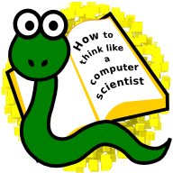

######################################
How to Think Like a Computer Scientist
######################################

3rd Edition (Using Python 3.x)

by Jeffrey Elkner, Peter Wentworth, Allen B. Downey, and Chris Meyers

illustrated by Dario Mitchell

* `Copyright Notice <copyright.html>`__ 
* `Contributor List <contrib.html>`__
* `Chapter 1 <PvL_01.html>`__ *The way of the program*
* `Chapter 2 <PvL_02.html>`__ *Variables, expressions, and statements*
* `Chapter 3 <PvL_03.html>`__ *Program Flow*  
* `Chapter 4 <PvL_04.html>`__ *Functions*
* `Chapter 5 <PvL_05.html>`__ *Datatypes*
* `Chapter 6 <PvL_06.html>`__ *Numpy*
* `Chapter 7 <PvL_07.html>`__ *File I/O*
* `Appendix A <PvL_A.html>`__ *Writing Your Own Modules*
* `Appendix B <PvL_B.html>`__ *Datatypes*
* `Appendix C <PvL_C.html>`__ *Recursion*
* `Appendix D <PvL_D.html>`__ *Object Oriented Programming*
* `Appendix E <PvL_E.html>`__ *Exceptions*
* `Appendix F <PvL_F.html>`__ *Fitting and Scientific Data Handling*
* `Appendix G <PvL_G.html>`__ *PyGame*
* `GNU Free Document License <fdl-1.3.html>`__ 

.. toctree::
    :maxdepth: 1
    :numbered:

    PvL_01.rst
    PvL_02.rst
    PvL_03.rst
    PvL_04.rst
    PvL_05.rst
    PvL_06.rst
    PvL_07.rst

.. toctree::
    :maxdepth: 1
    :hidden:

    copyright.rst
    contrib.rst

* :ref:`search`
